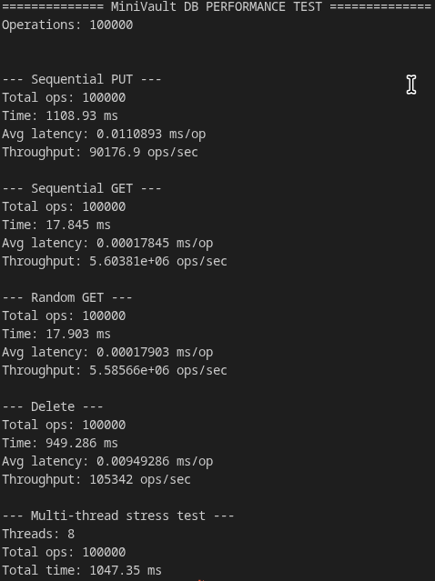

# MiniVaultDB

**MiniVaultDB** is a lightweight **LSM-style key–value database** implemented from scratch in **C++17** using **POSIX I/O**.  
The project focuses on **storage engine correctness**—durability, crash recovery, and bounded memory—rather than production-scale optimizations.

---

## Overview

MiniVaultDB implements the core building blocks of modern key–value stores:

- Write-Ahead Logging (WAL)
- In-memory MemTable with custom allocator
- Immutable on-disk SSTables
- Crash-safe recovery
- WAL rotation (checkpointing)

The database is intentionally **single-threaded** and **without compaction** to keep the design simple and auditable.

---

## Features

- **Write-Ahead Log (WAL)**
  - Append-only log using POSIX file operations
  - Length-prefixed binary records with CRC32 validation
  - Replayed on startup for crash recovery
  - Rotated after flush to bound log size
  - Format 
    ```lua
    +----------------+----------------+------------------+----------------+
    | uint32 length  | uint32 crc32   | record payload  | next record... |
    +----------------+----------------+------------------+----------------+
    ```


- **MemTable**
  - In-memory key–value store
  - Custom arena allocator for fast, linear allocations
  - Custom open-addressing hash table (no STL containers)
  - Tracks logical size to trigger flush
  - Supports TTL and tombstone

- **SSTables**
  - Immutable, sorted on-disk files
  - Created by flushing a MemTable
  - Queried using binary search
  - Multiple SSTables may coexist (no compaction)

- **Crash Recovery**
  - Loads existing SSTables on startup
  - Replays remaining WAL entries
  - Restores consistent state after crashes

---

## Architecture

### Write Path

```

put() / del()
   ↓
WAL (append-only)
   ↓
MemTable (in-memory)
   ↓ (size limit reached)
Flush
   ↓
SSTable (immutable, sorted)

```

### Read Path

```
MemTable → Immutable MemTable → SSTables (newest → oldest)
```

---

## Durability & Recovery

MiniVaultDB guarantees durability through:

1. **WAL-first writes** — data is logged before being applied
2. **Crash recovery** — WAL replay reconstructs MemTable
3. **Checkpointing** — WAL rotation after flush bounds recovery time

After a crash or restart, the database restores its state using:
- Existing SSTables
- Remaining WAL entries

---

## Build

Example build command (project root)

 - just run a make

 - commands

```
  make // create a object file
  make test TEST=yourmainfilepath
```
- to clearn
```
  make clean
```

---

## Usage (Example)

```
> put key1 value1 
OK
> get key1
value1
> del key1
OK
```

---

## Testing & Evaluation

- Verified correctness of:
  - put / get / delete
  - flush and WAL rotation
  - crash recovery
- Stress-tested with large write workloads
- Observed and analyzed read amplification behavior when many SSTables accumulate

---

## Known Limitations

- ❌ No SSTable compaction  
- ❌ No bloom filters or block cache  
- ❌ Single-threaded execution  
- ❌ No background maintenance threads  

These limitations are **intentional** to keep the project focused on core storage-engine concepts.

---

## Project Layout

```
include/
  engine/
    memtable.hpp
    wal.hpp
    sstable.hpp
  util/
    arena.hpp
    hash.hpp
    crc32.hpp
src/
  engine/
    memtable.cpp
    wal.cpp
    sstable.cpp
  util/
    arena.cpp
    hash.cpp
    crc32.cpp
  db/
    db.cpp
tests/
  test_db_basic.cpp
  test_db_flush.cpp
  test_db_recovery.cpp
  test_db_manual.cpp
README.md
```

---


## Peformance 




## Design Goals

- Prioritize correctness and durability
- Avoid STL containers in core components
- Keep memory usage bounded
- Make recovery behavior explicit and testable
- Provide a clean foundation for future optimizations

---


## Future Work

- SSTable compaction
- Bloom filters for faster reads
- Block cache (LRU)
- C API and Python bindings
- Background maintenance threads
- Formal performance benchmarks

---

## usage
- Machine learning experiment metadata storage
- Local feature cache for ML inference
- Email processing pipeline (e.g., Gmail-like systems)
- Small company internal tooling
- Background job and task queue state
- Edge analytics and telemetry buffering
- analyzing forecasting weather


## Key Takeaway

> MiniVaultDB demonstrates how modern key–value databases achieve durability and correctness using WAL, MemTables, and immutable SSTables—without relying on existing database libraries.
